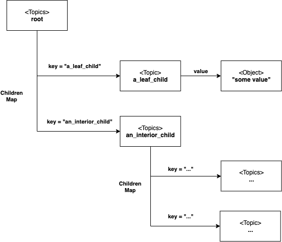

# Configuration

The Greengrass config is basically a hierarchical key-value store with timestamps.

1. [***Configuration***](/src/main/java/com/aws/greengrass/config/Configuration.java)
   Represents a tree of linked nodes, wherein Greengrass maintains its config state.
   The kernel saves this tree to disk in the form of a transaction log.
   All services and components maintain their own configuration values within the tree.
2. [***Node***](/src/main/java/com/aws/greengrass/config/Node.java)
   Represents a node within the configuration tree. This is the abstract base class for Topic and Topics classes.
3. [***Topic***](/src/main/java/com/aws/greengrass/config/Topic.java)
   Represents a leaf node within the configuration tree. A Topic has an associated configuration value.
4. [***Topics***](/src/main/java/com/aws/greengrass/config/Topics.java)
   Represents a non-leaf node within the configuration tree. A Topics instance has children, and each
   child is an instance of either Topic or Topics.

Below is a diagram showing the configuration tree structure.

## Transaction Log Persistence

Whenever a configuration value changes, the ConfigurationWriter writes that change to a transaction log on disk.
On startup, the Kernel loads configuration values from the transaction log.

### Exception: memory-only configuration values

Any Topic with a name prefixed by an underscore character ("_") will be ignored for purposes of writing to the transaction log.
These configuration values do not persist across Kernel restarts.

## Further Reading
For more on how the Kernel initializes in-memory configuration, refer to the
[***Lifecycle Management README***](/src/main/java/com/aws/greengrass/lifecyclemanager/README.md).
