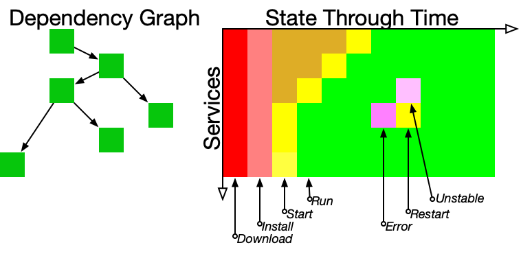

# Dependency Injection
Dependency Injection is really a misnomer: since dependency injection often involves
creating the object that is depended-on.  This has evolved into full lifecycle management.

<style>td,th,table { padding:0 4pt !important; border:none !important}</style>

At the core are three related classes:

| Class | Role |
| --------- | ---------------- |
`Context` | Collection of Objects.  This is the source of all objects that can be injected into other objects.  Getting an object from a Context may cause it to be created and injected. Injecting object B into object A implicitly states that "A depends on B", and adds a relationship to the dependency graph
| `Lifecycle` | The superclass of all objects that have lifecycles.  The dependency graph constructed by injection influences the progress of objects through their life cycles.  If A depends on B, then A will not be started until B is started.  This can be influenced by the @StartWhen annotation.
| `Configuration` | All objects can potentially have configuration parameters.  Some are used by the `Context` and `Lifecycle` classes.  A particularly interesting usage in the Context object where an injected dependency may be replaced by some sub class/interface - enabling "mocking" for simulation and test.

You start by creating a context:
```java
Context context = new Context();
```

Then you "get" an object from it:
```java
Bogon bogon = c.get(Bogon.class);
```
If there is no instance of the Bogon class in the context, it is created via it's default constructor.  Then, if it is a Lifecycle class, its lifecycle begins.

Say the class looks like this:
```java
class Bogon {
    @Inject Engine engine;
}
```
When this class is created by the initial get(), it will be searched for dependencies that need to be injected, which will cause a get(Engine.class) to happen, and the process repeats.  One single initial "get" can cause a whole web of objects to be created.

Done this way, every object is a singleton.  But if you need to have multiple similar objects in the context, they can be named:
```java
    @Inject @Named("left")  Engine left; // left engine
    @Inject @Named("right") Engine right; // right engine
```

Alternatively, you could also use Dependency injection via constructor:

```java
class BogonWithNamedConstructorInjection {
    Engine leftEngine;
    Engine rightEngine;

    @Inject
    public BogonWithNamedConstructorInjection(@Named("left") Engine leftEngine, @Named("right") Engine rightEngine) {
        this.leftEngine = leftEngine;
        this.rightEngine = rightEngine;
        // more initialization logic with engines...
    }
}
```
If you need to do additional initialization logic with injected dependency, you could do Dependency Injection via 
constructor.

Only **one** constructor with @Inject annotation is allowed. Otherwise, DI would be unable to decide which one to 
invoke when creating a new instance.


# Lifecycles
Objects that subclass GGService also participate in life cycle management.  Such objects
can be in any of the following states:

| State | Meaning
| ----- | -------
|    Stateless | Object does not have a state (it is not a Lifecycle)
|    New | Freshly created, probably being injected
|    Installed | Associated artifacts have installed.
|    Starting | Executed when all dependencies are satisfied. When this step is completed the service will be Running.
|    Running | Up and running, operating normally.  This is the only state that should ever take a significant amount of time to run.
|    Errored | Not running.  It may be useful for the enclosing framework to restart it.
|    Stopping | Shutting down
|    Broken   | Errored repeatedly and will not be restarted
|    Finished | The service has done it's job and has no more to do.  May be restarted (for example, by a timer)


There are two related diagrams that help to understand how these fit together:



On the left is the dependency diagram which shows the interdependencies of all of the services. On the right is a
 timeline of the state changes of the individual services. They all get installed at the beginning, then then get
  started up in dependency order.  Periodically services will enter some error state, and (usually) recover eventually.
