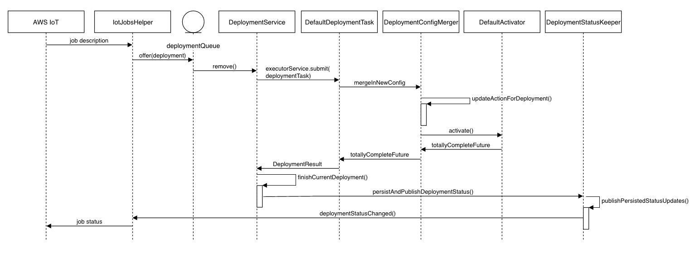
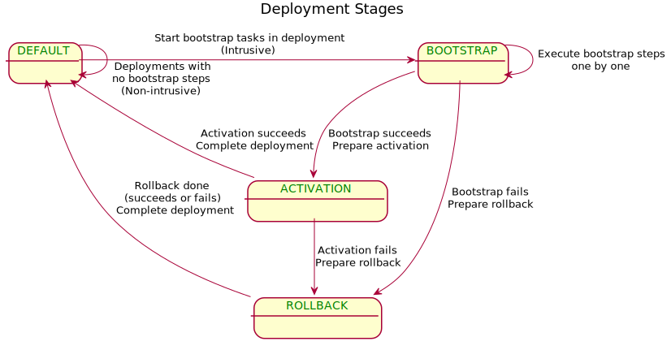
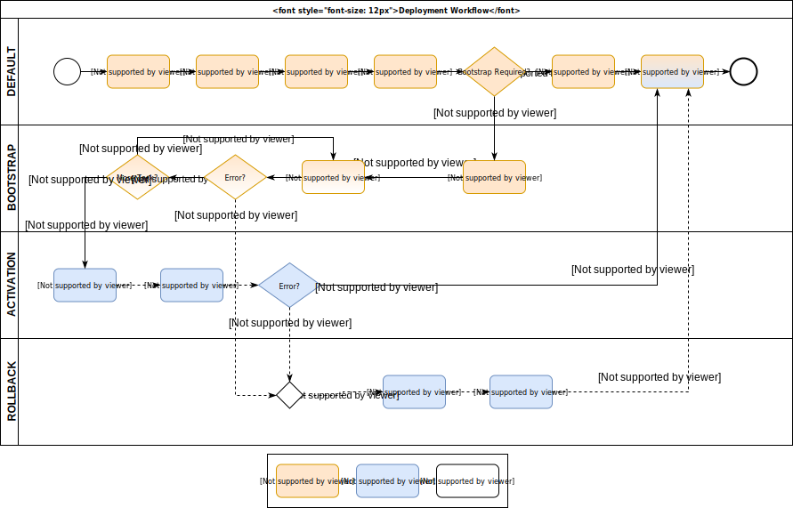

# Models
1. [***DeploymentDocument***](/src/main/java/com/aws/greengrass/deployment/model/DeploymentDocument.java) 
Represents the json document which contains the desired state for the device.
2. [***Deployment***](/src/main/java/com/aws/greengrass/deployment/model/Deployment.java) Represents creation of a
 new desired state for the device. This can come from multiple sources like IotJobs, device shadow or local CLI. Each
  Deployment is uniquely identified.

# Startup
1. [***DeploymentService***](/src/main/java/com/aws/greengrass/deployment/DeploymentService.java) starts as a
Greengrass service and initializes [***IotJobsHelper***](/src/main/java/com/aws/greengrass/deployment/IotJobsHelper.java)
and [***ShadowDeploymentListener***](/src/main/java/com/aws/greengrass/deployment/ShadowDeploymentListener.java).
2. *IotJobsHelper* and *ShadowDeploymentListener* connects to AWS Iot cloud and subscribes to the Iot jobs mqtt
 topics and shadow topics respectively.
3. As part of dependency injection, DeploymentService also initializes a Queue called *DeploymentsQueue*, which holds 
*Deployment* objects. *IotJobsHelper* and *ShadowDeploymentListener* communicate deployment notifications to *DeploymentService*
via the *DeploymentsQueue*.
1. (Optional) If component [aws.greengrass.Cli](https://github.com/aws-greengrass/aws-greengrass-cli) is deployed to the
 device running Nucleus, customers can also use CLI to create local deployment requests. Local deployment will also
  be added to *DeploymentsQueue* and then processed by DeploymentService.
 
# Workflow
## Thing Group Deployment (IoT Jobs)
### Successful deployment via IotJobs
1. [***IotJobsHelper***](/src/main/java/com/aws/greengrass/deployment/IotJobsHelper.java) receives notification when
    - A new job is created in cloud.
    - A job is completed (FAILED/SUCCEEDED)
    - A job is cancelled 
    The notification contains the list of QUEUED and IN_PROGRESS jobs according to status in cloud
2. Upon receiving the notification, if there are any QUEUED jobs in the list then *IotJobsHelper* requests for the 
**next** *pending* job document. *pending* can mean jobs which are either IN_PROGRESS or QUEUED. **next** represents 
the chronological order of creation of jobs in cloud. Cancellation of a job in cloud will remove the job from the 
list. If a device is processing a job (with job id "1"), it means the status of this job is IN_PROGRESS. If the 
device requests for next pending job at this time then it will receive job with JobId "1"  
3. Upon receiving a QUEUED job document helper creates the *Deployment* object and passes it to *DeploymentService* 
via the *DeploymentsQueue*
4. *DeploymentService* polls the queue and upon receiving a Deployment, starts processing the deployment and stores 
current deployment metadata (id and type (IOT_JOBS) of the deployment) it is currently processing
5. *DeploymentService* waits for the deployment to get completed and then invokes [***DeploymentStatusKeeper***](/src/main/java/com/aws/greengrass/deployment/DeploymentStatusKeeper.java)
to update the status of the job in the cloud. Deployment Service then resets the current deployment metadata. Service 
only processes one deployment at a time

Below is a representation of the deployment workflow, starting from notification receipt by the IotJobsHelper.

### Cancellation of deployment via IotJobs
1. For cancellation of any job which was not yet processed by device does not require any action from device
2. If a job "Job1" is in progress and user cancels "Job1" from cloud. Device will receive the notification and will 
request the next pending job and will get either the next job in list or an empty list (if nothing is there)
3. Device then identifies that the current job "Job1" has been cancelled and attempts to cancel the ongoing "Job1" 
  
## Thing Deployment (Thing Shadow)
### Successful deployment via Shadow
1. [***ShadowDeploymentListener***](/src/main/java/com/aws/greengrass/deployment/ShadowDeploymentListener.java) subscribes to the below topics of device's classic shadow
    - update/accepted topic to listen to changes in the shadows desired state
    - get/accepted topic. ShadowDeploymentListener publishes to get topic to retrieve the shadow state when the device starts up or re-connects after being offline.
     This is required as the device can miss shadow update notifications when offline.
    
2. Once a notification is received, the desired state of the shadow contains the fleet configuration. A new Deployment object is created using the fleet configuration and 
passed on to DeploymentService  via the DeploymentsQueue.

3. For shadow based deployment, the device would always move to the configuration contained in the desired state of the shadow. 
If multiple shadow deployments are scheduled, device only need to process the last deployment and all previous deployments can be cancelled.
DeploymentService makes a best effort attempt to cancel an ongoing deployment if a new deployment is scheduled. 

4. Once deployment is successful, ShadowDeploymentListener updates the reported state of the device classic shadow
 
### Cancellation of deployment via Shadow

#### What happens on the cloud side
When cancelDeployment is called for shadow based deployment, the cloud service checks if the desired state and reported state of the
device classic shadow are in sync. If they are in sync, the deployment is complete and cannot be cancelled.
If they are not in sync, the cloud sets the desired state with value from reported state.

#### What happens on the device side
1. ShadowDeploymentListener gets the notification that the desired state changes and it schedules a new deployment
 with DeploymentService
2. Deployment service will make a best effort attempt to cancel the ongoing deployment. 
    1. If the ongoing deployment cannot be cancelled then, it would run its course and then the new deployment will
     bring the device to desired state
 
## Local Deployment via CLI
1. Greengrass CLI receives the instruction from customers to create a deployment. Upon getting such instruction
 CLI create a *Deployment* object and put it in *DeploymentsQueue*
2. *DeploymentService* polls the queue and upon receiving a Deployment, starts processing the deployment and stores 
   the id and type (LOCAL) of the deployment it is currently processing
3. *DeploymentService* waits for the deployment to get completed and then invokes [***DeploymentStatusKeeper***](/src/main/java/com/aws/greengrass/deployment/DeploymentStatusKeeper.java) 
to update CLI with the status of the job.
1. Customers can use CLI again to check the status of local deployments.
    
## Multiple Group Deployments
An Iot device can belong to multiple Iot ThingGroups. When a configuration is set and published for any such group, 
that results in a deployment on every device in that group. As device can belong to multiple groups, the device needs
 to maintain a status of what components are being deployed as part of which groups. This is needed so that a 
 deployment for one group does not remove the components deployed previously as part of another group.
> - ThingGroup deployments can belong to different groups named `thinggroup/<group-name>`
> - Thing deployments belong to group `thing/<thing-name>`
> - Local deployments belong to group `LOCAL_DEPLOYMENTS`

 1. [***DeploymentService***](/src/main/java/com/aws/greengrass/deployment/DeploymentService.java) maintains a 
 mapping of groupName to the root components and their version constraints, deployed as 
 part of that group. This 
 mapping is stored in the DeploymentService's [***Configuration***](/src/main/java/com/aws/greengrass/config/Configuration.java).
 2. Upon receiving a new deployment from the *DeploymentsQueue*, when constructing the new configuration for the 
 Nucleus, the [***DeploymentTask***](/src/main/java/com/aws/greengrass/deployment/model/DeploymentTask.java) uses the
 saved mapping to calculate the set of root components. For the group that is being deployed, it takes the root 
 components from the deployment document. For all other groups it takes the root components from the saved mapping.
 3. [***DependencyResolver***](/src/main/java/com/aws/greengrass/componentmanager/DependencyResolver.java) uses the
  saved mapping to calculate 
 version constraints on all components. For the group being deployed it takes the version constraints from the 
 deployment document and for other groups it takes the version constraints from the saved mapping.
 4. Upon successful completion of deployment, the DeploymentService replaces the entry of deployed group with the 
 latest set of root components and version constraints that got deployed, before polling for next deployment. In case 
 of failure the entry is not changed.    

## DeploymentTask in details
Based on the recipe definition, changes to a component in deployments can be intrusive (to Nucleus lifecycle and as a
 result, to all other services), or non-intrusive (only impacting its own runtime and those of depending components
). Examples of intrusive deployments are, changing JVM options of Nucleus runtime, and updating Nucleus version.

During an intrusive deployment, multiple Nucleus instances will be launched to complete the workflow (one instance
 running at a time). The old instance has to persist and hand over deployment information and progress to the next
  one.
  
Deployment stage can be interpreted by both Nucleus and [***DeploymentService***](/src/main/java/com/aws/greengrass/deployment/DeploymentService.java).
* DEFAULT: No ongoing deployment or in non-intrusive workflow of deployments
* BOOTSTRAP: Execution of bootstrap lifecycle steps, which can be intrusive
* ACTIVATION: Nucleus restarts into a new instance with new configurations, and DeploymentService will continue
 to monitor health and report the deployment result. 
* ROLLBACK: Error occurred in BOOTSTRAP or ACTIVATION. Nucleus rolls back to the old instance with
 previous configurations. DeploymentService will monitor the rollback and report deployment results.
 
Below is the state diagram of deployment stages.

Deployment Task Workflow.

