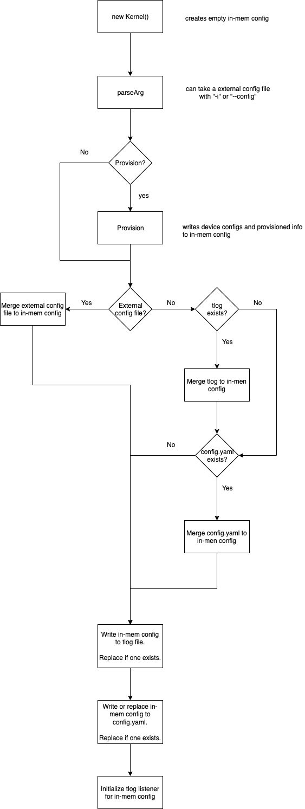

# Lifecycles

## Kernel Lifecycle

### Transaction Log
Below is a flowchart showing how the Kernel initializes in-memory configuration.

For more information about the configuration data structure, refer to the
[***Configuration README***](/src/main/java/com/aws/greengrass/config/README.md).
