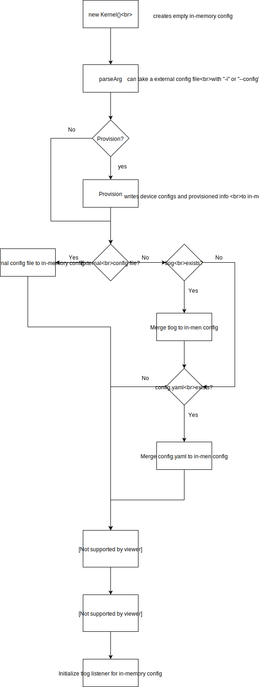

# Kernel

### How kernel reads config.tlog and config.yaml when starting

### Potential issues
Ideally right after we create the in-mem config, we should
1. decide if kernel needs to merge from existing tlog/config file to restore the history
1. hook up the tlog listener so that every update to in-mem config is then captured to tlog automatically.

But now both 1 and 2 are done at later stage. This causes two potential issues but neither is a real issue now. It may 
become real issue if some conditions changes. So we are documenting them below.

1. Since the tlog listener only created at very late stage, a potential problem is that the changes to in-mem config 
before the listener gets hooked up will be only in the memory. 

   1. We get around this problem by dumping the in-mem to a 
new tlog file right after we have merged existing tlog/config.

2. Since kernel merges from existing tlog/config file after the provision step, and the provision step updates the 
in-mem config, a potential issue is that the provision step will always update in-mem config, without knowing the 
histories from existing tlog/config files. 

   1. This is not a real issue for now because the provision step will only 
be executed if a user specifies doing so. When a user specifies that he or she wants to do provision, then it's fine
to always update in-mem config and ignores the history in tlog. But this condition may change in the future.

