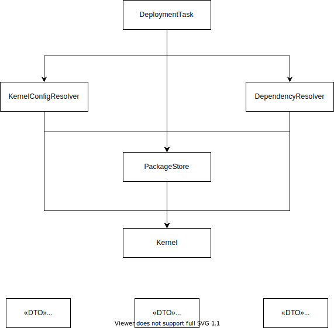

# Package Manager

### High-level class structure


### DependencyResolver
This class resolves the dependecy by exposing:

```java
public List<PackageIdentifier> resolveDependencies(final DeploymentDocument document, List<String> newRootPackages);
```

### PackageStore
This class is responsible for interactions with packages.
It exposes the following APIs:


```java
public Iterator<PackageMetadata> listAvailablePackageMetadata(String packageName, Requirement versionRequirement);

public Future<Void> preparePackages(List<PackageIdentifier> pkgs) {

public Package getRecipe(PackageIdentifier pkg) {
```

### KernelConfigResolver
This class resolves a kernel configuration map by exposing:
```java
public Map<Object, Object> resolve(List<PackageIdentifier> packagesToDeploy, DeploymentDocument document,
                                       List<String> rootPackages) 
```